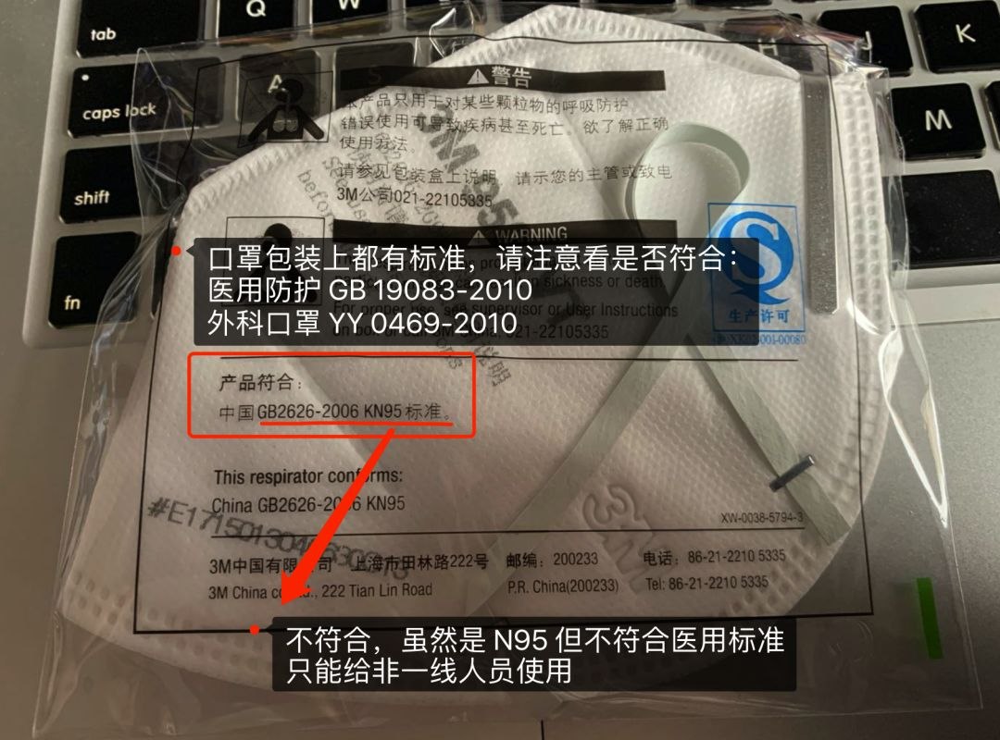
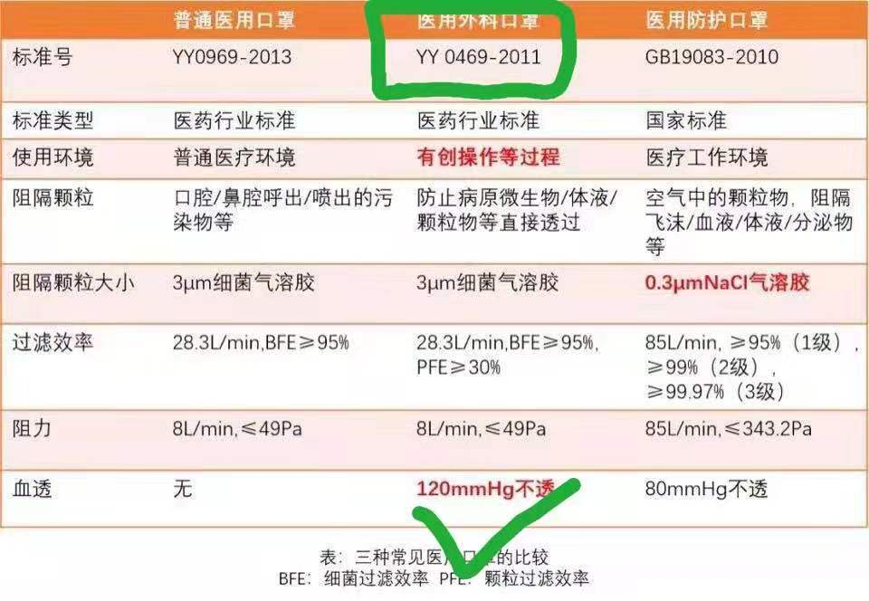

#  新型冠状病毒(抗击疫情捐赠款物篇)

> 建议有化学、医疗、漫画、IT、运营等大神共同传播、维护。

	生命重于泰山，疫情就是命令，防控就是责任。

--
	问:为什么红十字会接受了社会捐赠大量物资，而医院还是缺物资？
	答:一个重要原因就是消耗量大于供应。
	   二捐赠物资和急需物资，品种、型号、标准不是很好地对应。
	   三还有周转不够快，调拨不及时等，这些都是我们需要在工作中不断加以改进的(专业的事交给专业的人做)。

	个人理解的是第三有部分也是因二导致。
	请先行沟通捐赠意向，得到确认后再行捐赠(仅官方指定外的物品).
	引用的网络连接,如有侵权,请联系作者删除.

##  3  概述需求

>各类捐赠物资均要求
>>在保质期内

>>外包装完好,无污损

>>正规企业产品

>>符合国家有关质量标准

### 3.1  防护类用品
>口罩、防护服、护目镜在第4节详解标准和识别方法	

	医用防护口罩（GB19803-2010）(N95有GB19083-2010版、其他版本)
	医用外科口罩（YY0469-2010）
	N95其他版本
	普通医用口罩

- 3.1.1 服装类

		防护服（GB19082-2003）
		手术衣
		医用帽
		一次性消毒床罩

		
- 3.1.2 护目类
	
		防冲击眼罩
		防护面罩
		护目镜

- 3.1.3 手套/鞋套类

	[1][丁腈手套(抗拉强度≥14MPa)](https://detail.tmall.com/item.htm?spm=a220o.1000855.w5003-21912373855.9.4b0c2cfaox5WbW&id=556242549623&rn=17e7d08795bca142c9d31183296144ab&abbucket=9&skuId=4221430566889&scene=taobao_shop)
	
	[2][乳胶手套:GB10213-2006](https://detail.tmall.com/item.htm?spm=a1z10.5-b-s.w4011-16764042647.45.7ad67709fxJQ4d&id=556629587831&rn=01b07d073ecef267c77c5f1766dd5330&abbucket=15)
	
	[3][鞋套/靴套](https://detail.tmall.com/item.htm?spm=a220m.1000858.1000725.76.39b5372aSRDPhV&id=606600774529&skuId=4420064614906&areaId=140500&user_id=2201514190107&cat_id=2&is_b=1&rn=a58e081d9e69c0f0bc7d93144c91e23a)

### 3.2  消毒类用品

-  3.2.1  [速干手消毒液](https://s.taobao.com/search?q=速干手消毒液)（含醇和过氧化氢类或季铵盐类等）
	
	[1][乙醇类-含量75%上,不要氯已定的](https://item.taobao.com/item.htm?spm=a230r.1.14.23.127a2c2fBxaBwI&id=573730067825&ns=1&abbucket=18#detail)
	
	[2][过氧化氢-双氧水](https://detail.tmall.com/item.htm?spm=a220m.1000858.1000725.1.5adf4fe8ZkFROO&id=593917787971&skuId=4103449053215&areaId=140500&user_id=3247387476&cat_id=2&is_b=1&rn=36e9375c2928436e4017b738cc696c18)

	[2.1][闻:有有强烈刺激性气味的是过氧乙酸，过氧化氢是双氧水](https://detail.tmall.com/item.htm?spm=a220m.1000858.1000725.6.214f4fc2Ryd5Tq&id=527648185364&areaId=140500&user_id=2617444476&cat_id=2&is_b=1&rn=61e4baa50ffd452247943cc2a9336ea7)

	[3][季铵盐消毒液](https://detail.tmall.com/item.htm?spm=a1z10.3-b-s.w4011-16469431882.14.20406c08X2MV4B&id=564690430424&rn=5e10d2576d3d65a2e3fdaa382fb15d22)

	[4][洁肤柔抗菌洗手液](https://item.taobao.com/item.htm?spm=a230r.1.14.16.1d9d1466EWRzhz&id=536291490922&ns=1&abbucket=18#detail)
	
	[5][酒精消毒棉片-含量75%的](https://detail.tmall.com/item.htm?spm=a220m.1000858.1000725.11.19ce7134UC5Kjd&id=567466669032&skuId=4378149514345&areaId=140500&user_id=3880954639&cat_id=2&is_b=1&rn=804a194194ae6975ac236a303e9a33c2)

-  3.2.2  消毒液
	
	[1] [84消毒液](https://detail.tmall.com/item.htm?spm=a220m.1000858.1000725.41.20106bcce3Vtnl&id=611702765195&areaId=140500&user_id=654395822&cat_id=2&is_b=1&rn=79eccbd214e4864a96e8b404f8068ad0)

	[2] [84消毒泡腾片](https://detail.tmall.com/item.htm?spm=a220m.1000858.1000725.7.61e27a55m6rVKc&id=588513900040&areaId=140500&user_id=2722934395&cat_id=2&is_b=1&rn=975d10ea9b9352719c0450f8539613e8)。
	
	[3] [碘伏皮肤消毒液](https://detail.tmall.com/item.htm?spm=a220m.1000858.1000725.31.55a73840C6Gsdr&id=576301312840&skuId=3797071841269&areaId=140500&user_id=4106868661&cat_id=2&is_b=1&rn=2c3a7495240cb9c05e361cf64623c42e)
		
	[4]安尔碘皮肤消毒剂、聚维酮碘消毒液
	
- 3.3.3 喷雾壶
	
	[1][84-喷壶](https://detail.tmall.com/item.htm?spm=a220m.1000858.1000725.6.77f93c58yDOvvo&id=37181994159&skuId=3906191089788&areaId=140500&user_id=1974397806&cat_id=2&is_b=1&rn=e3ee8f9d8caf9e28086fe4f7776013fd)
	
	[2][酒精-高压喷雾瓶](https://item.taobao.com/item.htm?spm=a230r.1.14.1.235520f5CFKj3y&id=607426677018&ns=1&abbucket=18#detail)
	
	[3][酒精-随身喷瓶](https://detail.tmall.com/item.htm?spm=a230r.1.14.26.a5d435afxCufG1&id=567430418302&ns=1&abbucket=18)

- 3.3.4 医用紫外线消毒车

### 3.3  药品

######  3.3.1  抗病毒药

	干扰素(α-干扰素雾化吸入)
	奥司他韦
	洛匹那韦
	利托那韦
	阿比多尔
--
	自己根据症状找的,上面未提到的:
	头孢吡肟(四代)、头孢克肟(三代:迪沙-迪素-头孢克洛咀嚼片)
	万古霉素(抗生素)
	
######  3.3.2  中成药

	金花清感颗粒(淘宝、京东没找到)
	莲花清瘟胶囊
	双黄连口服液
	金叶败毒颗粒
-
	自己根据《诊疗方案(第四版)》找的,上面未提到的:
	----
	藿香正气胶囊（丸、水、口服液） 			:医学观察期-乏力伴胃肠不适
	疏风解毒胶囊（颗粒）、防风通圣丸（颗粒）:医学观察期-乏力伴发热
	喜炎平注射剂、血必净注射剂				:临床治疗期中期-疫毒闭肺
	参附注射液、生脉注射液					:临床治疗期重症期：内闭外脱

######  3.3.3  辅助用药

	免疫球蛋白(静注人免疫球蛋白 PH4 )
	甲泼尼龙
	益生菌(可使用肠道微生态调节剂，维持肠道微生态平衡，预防继发细菌感染)
	

######  3.3.4  缓解症状用药
>自己根据《First Case of 2019 Novel Coronavirus in the United States 》找的,上面未提到的
	
	对乙酰氨基酚(退热)
	布洛芬(退热,小孩的美林)
	愈创甘油醚(止咳)
	昂丹司琼(止吐)
	生理盐水
	

### 3.4 诊断类用品

	手持红外体温测试仪
	水银体温计(家庭备用还是挺实惠)
-
	诊断试剂(诊断试剂是需要低温运输，同时也需要一定的医疗设备才能进行测试;这个专业了,得联系厂家)

##  4  详细标准(大宗)

> N95口罩、医用外科口罩、连体防护服、护目镜。

###  4.1  医用符合下列要求

######  4.1.1 厂家的执照 manufacturing license agreement(MLA)

 

######  4.1.2 医疗器械注册证 registration certificate formedical device

- [天猫商家提供的各种证件,不晓得是哪种](https://detail.tmall.com/item.htm?spm=a1z10.1-b-s.w4004-18730344941.8.202c77bec1s8zS&pvid=4d51e92f-61cf-424a-94d9-cd9f4de87f04&pos=4&acm=03068.1003.1.702815&id=548490903849&scm=1007.12941.156882.100200300000000)

- 是否下图二选一,防护服提到的是医疗器械生产许可证，不知道区别
	
 

 

######  4.1.3 检测报告 report for detecting and analyzing/test report
>还需要合格证不。
	
 

######  4.1.4能提供电子或正式收据，合法经营，否则不行。

### 4.2  口罩

>口罩标准汇总表
 

######  4.2.1  医用防护口罩(防飞沫、血液、体液；必须面部贴合不漏气，不带呼吸器)

> 3M 1860(为一线员工最标配)需要防高压液体喷溅
>> 1 近距离接触感染病人    
>> 2 进行有可能产生气溶胶的操作，如吸痰、插管等		
>> 3产生体液喷溅可能的操作
>> 3M 1860/1870/9132 可以

-  国内标准(GB19083-2010)
-  美国 NIOSH 认证，N95/N99 + ASTM F1862  ------level 1/2/3 (Fluid resistant CDC美国疾控认证)
-  欧标是 FFP2 或 FFP3，不带呼吸阀，同时具备 fluid resistant
-  日标是满足 1 或 2
		
		[1] 明确写明「サージカルＮ９５レスピレーターとして液体防護性があり、血液を含む液体等に有用」
		[2]  符合以下数据: 
			1) 人工血液不浸透性 80mmHg以上;
			2) ΔＰ（呼吸抵抗）＜35mmH2O

- 辨识

> 下图 3M GB 19083，型号 3M 9132

 
	
 

 

 

######  4.2.2  医用外科口罩     YY 0469-2010  /  0469-2011  

>需要独立包装（除了防护口罩外，医用外科口罩也非常需要  推荐 Winner 稳健医疗 [符合YY0469]）

######  4.2.3  普通医用口罩 

		普通人和不接触高压液体喷溅的医务人员使用

### 4.3  防护服(GB19082-2009 《医用一次性防护服技术要求》)

######  4.3.1 具体确定可用的型号有[杜邦 TYVEK 800 ](https://www.safespec.dupont.co.uk/products/product-detail.Tyvek.1550.html) 或 [TYVEK 1422A  -US $4](https://www.aliexpress.com/item/32868314620.html) 医用（下图）。

 

######  4.3.2 二级以上医用防护服：一般衣服上有红蓝条纹
	
 

### 4.4  护目镜
>弹性佩戴（可以和近视镜兼容）、视野宽阔、必须有防溅功能，四圈密封最好防雾.

######  4.4.1医生推荐型号 

- [3m 1623 防护眼镜（国标 GB/T 14866）](https://item.taobao.com/item.htm?spm=a230r.1.14.33.778a543enilXM0&id=611788546804&ns=1&abbucket=18#detail)

- [3M GA500防尘防液体飞溅护目镜--广州市保护者安防设备有限公司
](http://www.protectorppe.com/supply/4214185790.html)

>护目镜若不符合上述要求最好别买，不能用，可考虑防护面罩代替.

##  5  湖北红会第一批捐赠物资使用情况--词云画像

- 仅物资词云

- 计划对需求数据统计,看了好多条消息,基本都是大宗里的,py代码一起在github。

## 2  Ref

[1] [湖北红会_社会捐赠流程](http://www.hbsredcross.org.cn/fkxgfyzl/4423.jhtml)

[2] [湖北红会_国内捐赠标准]

[3] [写到防护服了发现对于口罩部分别人写的好,不过是同一天](http://www.jiebiaotest.com/a/news/497.html)

[4] [捐款捐赠渠道汇总](https://zhuanlan.zhihu.com/p/103949663)

[5] [口罩专题](https://www.chainnews.com/zh-hant/articles/075427370086.htm)

[6] [台州市新型冠状病毒感染的肺炎疫情防控指挥部](http://www.gbdfjzc.com/zixun/29422.html)

[7] [First Case of 2019 Novel Coronavirus in the United States](https://www.nejm.org/doi/full/10.1056/NEJMoa2001191#)